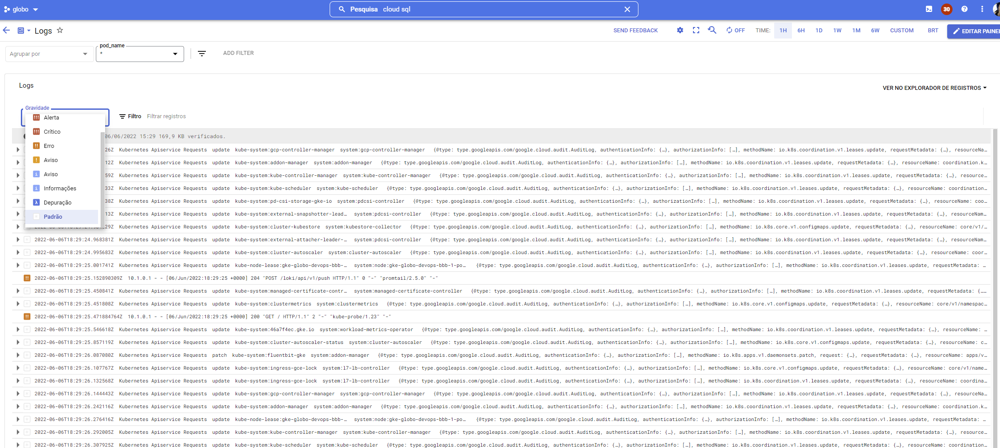
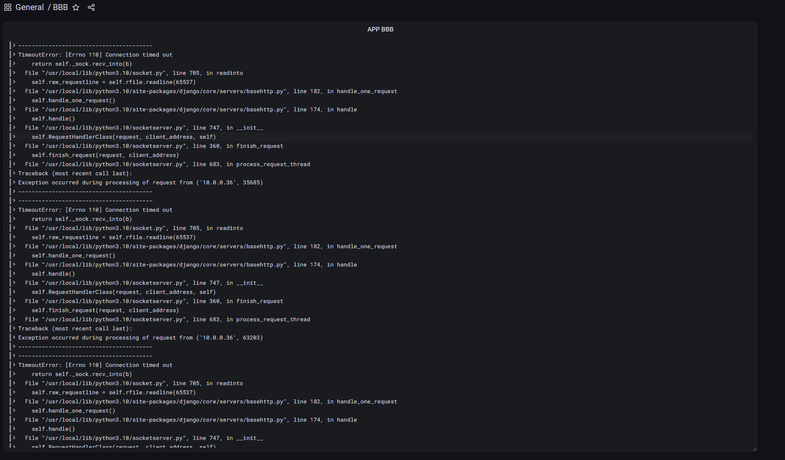
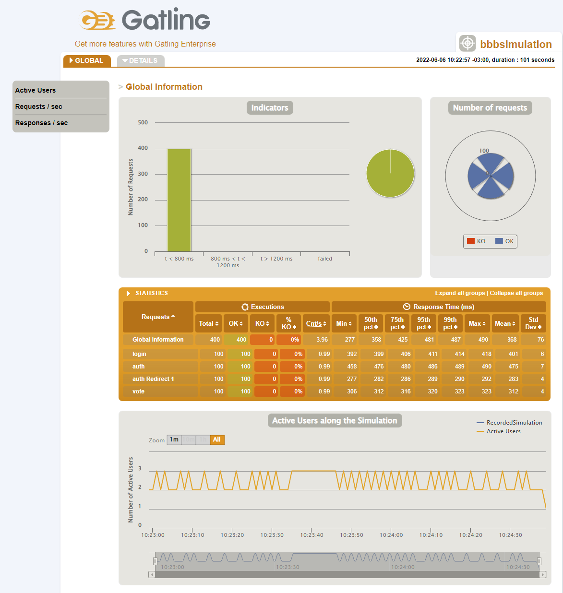
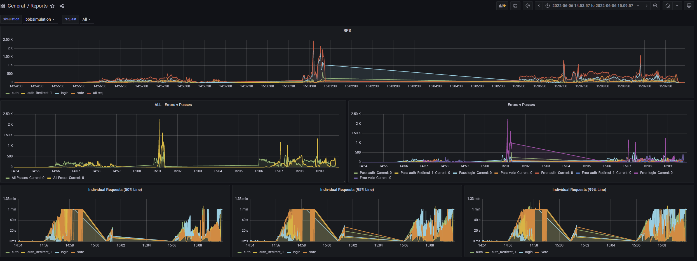
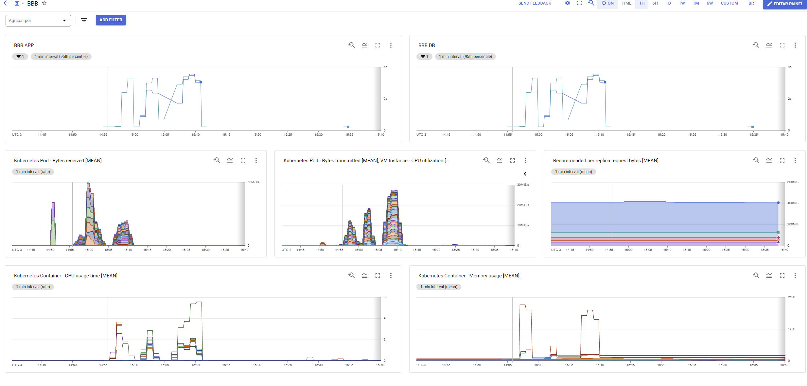
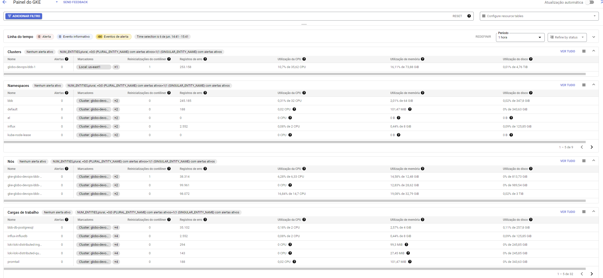
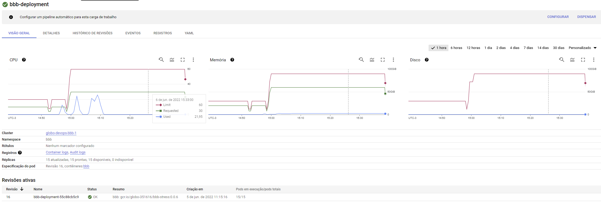

# Globo - Desafio

Este desafio tem como proposta criar uma aplicação para uma votação de BBB resiliente a bots, bem como seus testes de carga e todo ambiente envolvido, incluindo métricas e logs.


# Ambiente

O ambiente foi criado com terraform, a aplicações em Django contido em um Dockerfile.  

Usando deployment de kubernetes ou helm para implementação da aplicação e componentes (Loki, InfluxDB, Grafana, Postgre). 

Para o teste de carga utilizamos Gatling.

## Criando o ambiente Terraform

A princípio criamos um cluster GKE,  bem como sua parte de redes.
```
cd terraform/gke
export GOOGLE_APPLICATION_CREDENTIALS=$PWD/key.json (ou caminho similar)
terraform init
terraform plan
terraform apply --auto-approve
```

## Conectando ao cluster criado

```
gcloud container clusters get-credentials globo-devops-bbb-1 --region us-east1 --project globo-351616
```

## Aplicando tunning

Implementação:
```
gcloud container clusters get-credentials globo-devops-bbb-1 --region us-east1 --project globo-351616
kubectl apply -f kubernetes-tunning/

```


## Configurando PostgreSQL

### Primeira tentativa Terraform Cloud SQL (Descontinuado)

```
cd terraform/google_sql_database_instance
export GOOGLE_APPLICATION_CREDENTIALS=$PWD/key.json (Ou caminho similar)
terraform init
terraform plan
terraform apply --auto-approve
```

OBS: Foi necessário mudar essa alternativa uma vez que eu não poderia aumentar o max_connections e etc... do banco gerenciado. O que impedia de extrair o máximo da nossa aplicação

### Segunda tentativa PostgreSQL via helm
Documentação do chart: https://github.com/bitnami/charts/tree/master/bitnami/postgresql

Implementação:
```
kubectl create configmap -n bbb postgresql.conf --from-file=postgreSQL/postgresql.conf
helm repo add bitnami https://charts.bitnami.com/bitnami
helm install bbb-db -n bbb -f postgreSQL/values.yaml bitnami/postgresql
```


## Aplicação

Possivelmente não foi a melhor escolha com relação a performance, mas dado o tempo resolvi utilizar o [Django](https://docs.djangoproject.com/en/4.0/).

### Fork (Django-Poll-App)
Apesar do django possuir um ferramental pronto para construir um poll, descobri uma aplicação bem próxima da minha necessidade e adaptei ela para o nosso senário.

Documentação oficial do projeto: https://github.com/devmahmud/Django-Poll-App


### Diretório da aplicação 
Django-Poll-App-master

### Controle de Bot
Para controle de bots, adicionei o reCaptcha na pagina de votação.

### Adaptações
A aplicação por padrão só recebia 1 voto por usuário, ajustei para que o usuário pudesse votar livremente com tanto que utilizasse o reCaptcha.

### Alta disponibilidade
Para que a aplicação pudesse ser escalável troquei o banco padrão sqlite3 para PostgreSQL.

### Tentativa não concluída
Estava construindo um modelo de envio dos votos em fila para o Loki para que este tivesse em tempo real os votos e contagens. Mas não funcionou corretamente e então não foi possível dar prosseguimento dado o tempo.

### Dockerfile
o Dockerfile da aplicação se encontra na raiz do projeto.

### Deploy da aplicação

Será criado um deployment, um service com loadbalancer público e um hpa
OBS: Como não tinha um domínio disponível optei por não usar o ingress.

Implementação:
```
gcloud container clusters get-credentials globo-devops-bbb-1 --region us-east1 --project globo-351616

Deploy da aplicação
kubectl create ns bbb
kubectl -n bbb create secret generic credentials --from-env-file ./kubernetes-app/env-secret.txt
kubectl apply -f kubernetes-app/

```

## Logs

Apesar do [Logging](https://cloud.google.com/logging/docs) do GCP já contemplar praticamente toda a necessidade implementei o conjunto loki, grafana e promtail.

### Loki
Documentação oficial [Loki](https://grafana.com/docs/loki/latest/)
Documentação do chart: https://github.com/grafana/helm-charts/tree/main/charts/loki-distributed

Implementação:
```
kubectl create ns loki
helm repo add grafana https://grafana.github.io/helm-charts
helm repo update
helm upgrade --install loki --namespace=loki grafana/loki-distributed
```
### Grafana
Documentação oficial [Grafana](https://grafana.com/docs/grafana/latest/)
Documentação do chart: https://github.com/grafana/helm-charts/tree/main/charts/grafana

Implementação:
```
helm repo add grafana https://grafana.github.io/helm-charts
helm repo update
helm install loki-grafana grafana/grafana
helm install -n logs grafana -f loki/grafana/values.yaml grafana/grafana
```

### Promtail (Opcional)
Documentação oficial [Promtail](https://grafana.com/docs/loki/latest/clients/promtail/)
Documentação do chart: https://github.com/grafana/helm-charts/tree/main/charts/promtail

Implementação:
```
helm repo add grafana https://grafana.github.io/helm-charts
helm repo update
helm upgrade --install promtail -f loki/promtail/values.yaml grafana/promtail
```

### Imagens do Log
**Logging** 


**Loki**


## Teste de Carga

Como solução para o teste das cargas e tentativa de alcançar os 1000/s implementamos um teste utilizando o [Gatling](https://gatling.io/docs/gatling/).

  

Objetivo da simulação.
1 - Logar adquirindos os cookies necessários.
2 - Votar massivamente em uma das opções, estressando o máximo a aplicação e o banco.

### InfluxDB para métricas do teste.
Implementação:
```
kubectl create ns influx
kubectl apply -f loadtest/influxdb/secret.yaml

helm repo add grafana https://grafana.github.io/helm-charts
helm repo update
helm upgrade --install promtail -f loki/promtail/values.yaml grafana/promtail
```

### Gatling 
./gatling-charts-highcharts-bundle-3.7.6

Caminho para simulações ./gatling-charts-highcharts-bundle-3.7.6/user-files/simulations
- BBBSimulationLocal.java: Simulação direto na minha máquina para testes
- BBBSimulation.java: Simulação Real

- Execução:
```
./loadtest/gatling-charts-highcharts-bundle-3.7.6/bin/gatling.sh
```
OBS: Desativar o reCaptcha para simular, usar a imagem bbb-stress:0.0.6.

Report estático:
- Caminho ./gatling-charts-highcharts-bundle-3.7.6/results

**Report Estático** 


Report em tempo real:
- Teremos uma visão em tempo real do teste através de um board no Grafana.

**Report em tempo real** 


## Métricas

### Primeira consideração
Bom a princípio eu decidi colocar um prometheus com kube state metrics, no entanto eu estaria reinventando a roda uma vez que eu implementei o ambiente inteiro no GCP com as métricas habilitadas portanto usaremos o [metrics_gcp](https://cloud.google.com/monitoring/api/metrics_gcp) e boa parte de seus boards default já atendem o problema proposto. 

Decidi então focar nos testes do ambiente.

### Metrics GCP


**Basic Resources APP** 


**Kubernetes** 


**Deployment** 


